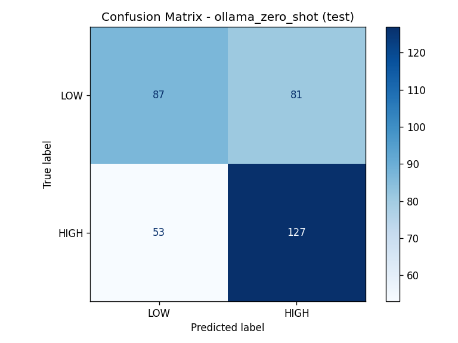
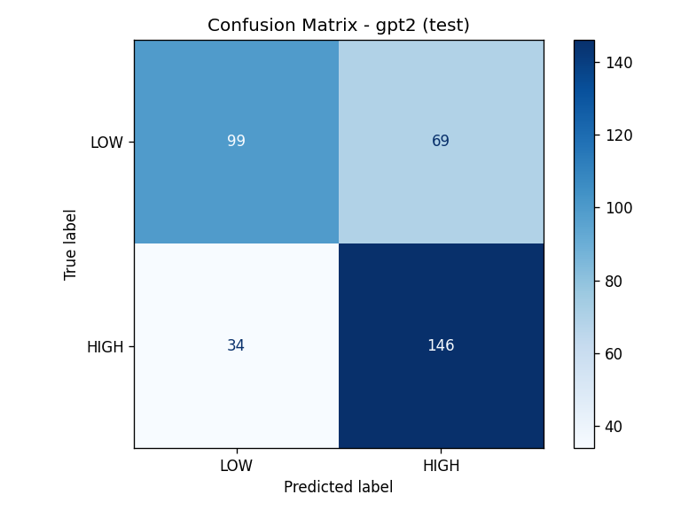
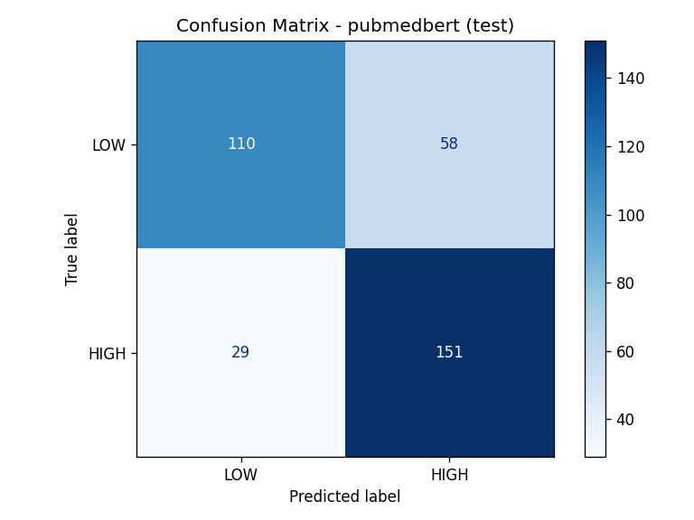
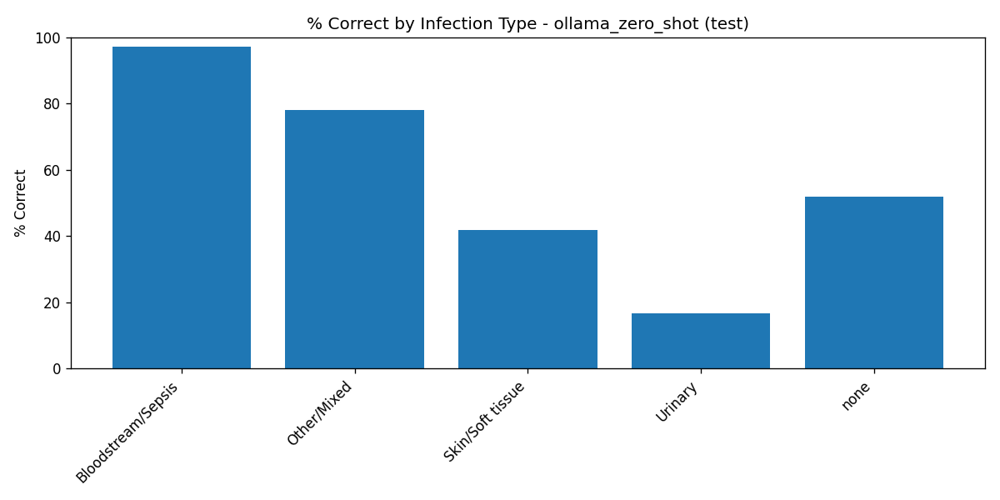
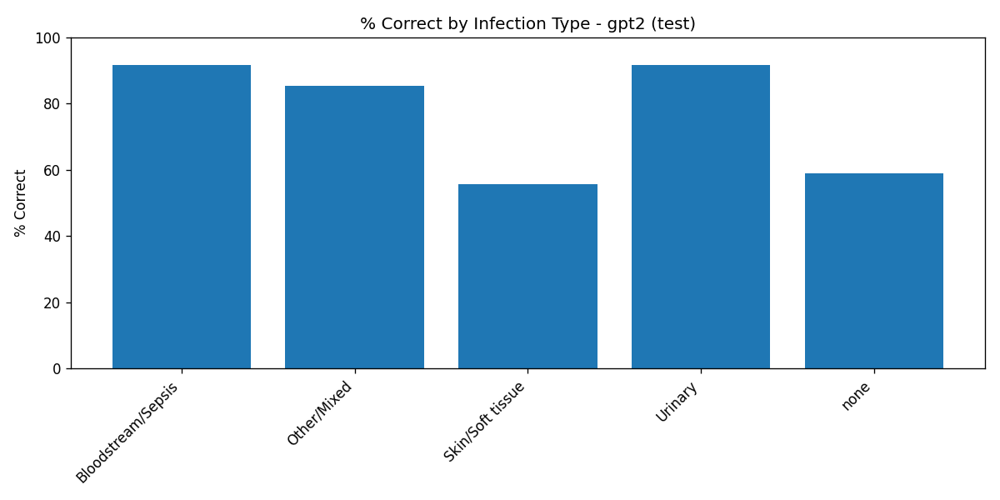
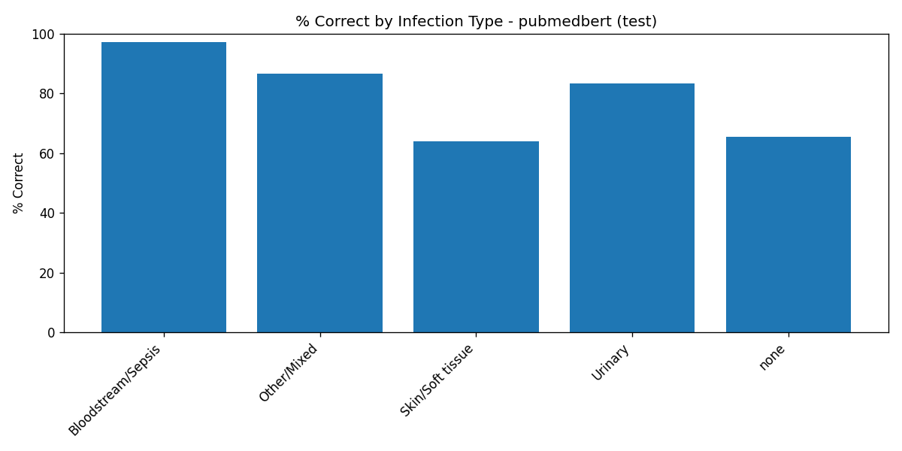

# Clinical Infection Risk Assessment System

## Team Members
- Tal Meillet
- Hodaya Yasayev Klenter

## Project Motivation

In the healthcare sector, vast amounts of unstructured clinical data-such as admission summaries, physician notes, and shift reports-contain critical clinical cues indicating patient risk. Currently, manual analysis of these texts is slow, inconsistent, and highly dependent on human expertise. This project aims to automate the detection of patients at high risk for Infections in hospitals using natural language processing. By analyzing unstructured clinical narratives, our system assists medical staff in early identification, patient prioritization, and clinical decision support.

## Datasets

We utilized the **MIMIC-IV Clinical Database Demo (v2.2)**. Since the demo lacked free-text notes, we implemented a sophisticated **Scaffold-and-Augment** pipeline to generate high-fidelity, realistic synthetic clinical summaries that map objective clinical data to subjective patient reports.


## Project Methodology: The Pipeline from MIMIC-IV to Synthetic Clinical Notes

Our project follows a rigorous, multi-stage pipeline designed to generate realistic clinical narratives while ensuring data integrity and clinical accuracy.


1. **Data Acquisition (MIMIC-IV Demo):** We utilized the **MIMIC-IV Clinical Database Demo v2.2**. This dataset provided the foundational structured records (Hosp & ICU modules) required to build our clinical foundation.
2. **Unified Table Construction:** We synthesized a `unified_table.csv` at the admission-level (one row per `hadm_id`). We carefully selected clinical columns such as demographics, lab results, and procedures, while applying **Anti-Leakage protocols** (generalizing antibiotic names and diagnosis titles) to ensure the model focuses on clinical context rather than explicit labels.
3. **Fact Profile Generation (Scaffold):** Using a Scaffold-and-Augment methodology, we transformed each row from the unified table into multiple, diverse factual profiles in JSON format. Each profile focuses on different clinical aspects (e.g., admission review, lab results, or procedural support), ensuring a rich variety of clinical facts while maintaining the veracity of the original data.
4. **Symptom Enrichment & Augmentation:** To mirror real-world subjective reporting, we integrated a symptom knowledge base derived from official clinical guidelines (CDC, IDSA, NHSN). We augmented the profiles by injecting subjective symptoms tailored to specific infection categories (e.g., respiratory symptoms for pneumonia, urinary symptoms for UTI). This ensures clinical consistency-patients are never assigned contradictory symptoms.
5. **LLM-Based Synthesis:** We employed local LLMs (via **Ollama**) to convert these structured JSON profiles into natural-sounding clinical narratives. By providing only pre-verified facts, we reduces hallucinations through factual scaffolding and quality checks and ensure that the generative model acts as a writer, not an originator of clinical facts.

The symptom knowledge base used in step 4 (CDC/IDSA/NHSN-derived, per infection category) is documented, with the specific clinical literature it draws on, in [`data/01_profiles/symptom_literature_review.md`](data/01_profiles/symptom_literature_review.md).

**Design decision - notes per admission:** the augmentation stage can generate multiple diverse note variants per admission. We initially generated 5 per admission, but found this let the downstream classifiers pick up on repeated phrasing patterns from the same admission and overfit noticeably faster; capping at 3 (see `MAX_NOTES_PER_ORIGINAL` in notebook `04`) kept enough variety for training while reducing that effect.

> **Note on `notebooks/02_synthetic_corpus_pipeline_openai.ipynb`:** this notebook's original run - used to develop and validate the note-writing prompt later reused in notebook `03` - was performed against an earlier version of the clinical profiles. Re-running it today will draw on the current `data/01_profiles/` output instead, so it may not reproduce the original historical corpus exactly. Its role in this repository is methodological validation of the prompt design, not a maintained second corpus; `data/02_clinical_notes/openai/` is intentionally empty for that reason.

## Input/Output Example

* **Input**: "A 79-year-old male presented as an urgent transfer from another hospital. He has been experiencing chills, loss of appetite, malaise, and rapid heart rate since admission. During a week-long stay, he underwent percutaneous abdominal drainage and parenteral nutrition. His white blood cell count is 12.6 with 82.9% neutrophils."
* **Output**: `High Infection Concern`

# Models
**EDA & Model Training & Evaluation:** We performed Exploratory Data Analysis (EDA) on the generated corpus and proceeded to train and evaluate the downstream infection classification models, validating our results against the ground-truth infection categories.

Three models are compared, forming a ladder from no training at all to full domain-specific fine-tuning:
1. Zero-shot baseline (Ollama, llama3.1:8b) - the same local LLM used to generate the notes, prompted directly with no task-specific training, to measure what fine-tuning is actually buying us over just asking the model.
2. GPT-2 - fine-tuned on our data, but with no biomedical pretraining.
3. PubMedBERT (microsoft/BiomedNLP-PubMedBERT-base-uncased-abstract-fulltext, from HuggingFace) - fine-tuned on our data, pretrained on biomedical text.

The two fine-tuned classifiers were trained with class-weighted loss and patient-disjoint train/validation/test splits (StratifiedGroupKFold, grouped by source_subject_id) to prevent leakage between splits.

**Why PubMedBERT?** It is pretrained on PubMed abstracts and full-text articles, so it already has useful priors over biomedical vocabulary and phrasing before we fine-tune it on our own clinical notes - as opposed to a general-purpose language model that has to learn that vocabulary from our (comparatively small) corpus alone. We deliberately compared it against GPT-2, a general-purpose model with no biomedical pretraining, specifically to isolate and demonstrate the effect of domain-specific pretraining on this task, rather than just picking one architecture and reporting its score in isolation.

## Why these metrics

- **Recall (HIGH)** is the metric we care about most clinically: it's the fraction of truly concerning cases the model actually catches. A missed HIGH case (false negative) means a real infection risk goes unflagged, which is the more costly error in a clinical screening context.
- **Precision (HIGH)** controls the false-alarm rate: how often a HIGH flag turns out to be wrong. Too low, and clinicians using the tool would face alert fatigue and start ignoring it.
- **F1 (HIGH)** balances the two into one number, useful for ranking models against each other.
- **ROC-AUC** summarizes ranking quality across *all* possible thresholds, not just the one we chose - useful for comparing models independent of where the operating point is set.

We picked the decision threshold on the validation set to balance both classes (macro-F1) rather than maximizing recall alone, since a threshold tuned purely for HIGH recall tends to over-predict HIGH and hurt LOW precision - see the Results below for where that trade-off still shows up.

# Results
 
On the held-out, patient-disjoint **test** split:
 
| Model | Recall (HIGH) | Precision (HIGH) | F1 (HIGH) | ROC-AUC |
|---|---|---|---|---|
| **PubMedBERT** | 0.839 | 0.722 | 0.776 | **0.812** |
| GPT-2 | 0.811 | 0.679 | 0.739 | 0.746 |
| Zero-shot (Ollama, no fine-tuning) | 0.706 | 0.611 | 0.655 | — |
 
*(Zero-shot has no ROC-AUC: it only ever outputs a label, not a probability score, so there's no threshold curve to compute AUC from.)*
 
Both fine-tuned models clearly outperform the zero-shot baseline on every comparable metric, and PubMedBERT outperforms the GPT-2 baseline on every metric too - consistent with the expectation that (1) task-specific fine-tuning helps substantially over prompting alone, and (2) biomedical pretraining gives a real additional advantage on clinical text over a general-purpose language model of similar size.
 
**Clinically, what does this mean?** PubMedBERT catches about 84% of true HIGH-concern notes (recall = 0.839) - a reasonable safety margin for a screening/decision-support tool, though ~16% of real concerns would still need to be caught some other way. Of the notes it flags as HIGH, about 72% are correct (precision = 0.722), i.e. roughly 1 in 4 flags is a false alarm - usable as a triage aid with a human in the loop, but not accurate enough to act on unreviewed. The AUC of 0.812 indicates good (not excellent) overall separation between the two classes across thresholds. The zero-shot baseline, by contrast, misses nearly 30% of true HIGH cases (recall = 0.706) with a higher false-alarm rate too (precision = 0.611) - usable as a rough first pass, but not as a substitute for the fine-tuned models.
 
<table>
<tr>
<th>Zero-shot (Ollama)</th>
<th>GPT-2</th>
<th>PubMedBERT</th>
</tr>
<tr>
<td></td>
<td></td>
<td></td>
</tr>
</table>

**Performance by infection type - PubMedBERT (test split):**
 
| Infection type | % Correct | Notes |
|---|---|---|
| Bloodstream/Sepsis | 97.2% | Strongest category across all three models |
| Other/Mixed | 86.5% | |
| Urinary | 83.3% | |
| Skin/Soft tissue | 63.9% | Weakest infection category for both fine-tuned models |
| No infection (LOW, true negatives) | 65.5% | 58 of 168 true-LOW notes predicted HIGH |
 
**Performance by infection type - GPT-2 (test split):**
 
| Infection type | % Correct | Notes |
|---|---|---|
| Bloodstream/Sepsis | 91.7% | |
| Urinary | 91.7% | |
| Other/Mixed | 85.4% | |
| Skin/Soft tissue | 55.6% | Weakest infection category for both fine-tuned models |
| No infection (LOW, true negatives) | 58.9% | 69 of 168 true-LOW notes predicted HIGH |
 
**Performance by infection type - Zero-shot baseline (test split):**
 
| Infection type | % Correct | Notes |
|---|---|---|
| Bloodstream/Sepsis | 97.2% | Matches PubMedBERT here - this category is unambiguous enough that even prompting alone gets it right |
| Other/Mixed | 78.1% | |
| No infection (LOW, true negatives) | 51.8% | 81 of 168 true-LOW notes predicted HIGH - the baseline over-flags LOW cases even more than the fine-tuned models |
| Skin/Soft tissue | 41.7% | |
| Urinary | 16.7% | By far the weakest result in the whole comparison - the zero-shot model misses nearly all true urinary infections |
 
<table>
<tr>
<th>Zero-shot (Ollama)</th>
<th>GPT-2</th>
<th>PubMedBERT</th>
</tr>
<tr>
<td></td>
<td></td>
<td></td>
</tr>
</table>
All three models are strongest on Bloodstream/Sepsis and weakest on Skin/Soft tissue and Urinary infections, and all three misclassify a meaningful share of true LOW-concern notes as HIGH - i.e., recall on HIGH cases comes at some cost to precision on LOW cases, and this trade-off is worst for the zero-shot baseline. Clinically, Bloodstream/Sepsis notes likely contain sharper, less ambiguous symptom language (e.g. clear systemic signs) than Skin/Soft tissue or Urinary notes, which may share more surface-level phrasing with non-infectious complaints - making that boundary genuinely harder, not just a model weakness. The zero-shot model's collapse on Urinary infections specifically (16.7%, vs. 83–92% for the fine-tuned models) is the clearest single piece of evidence in this project that fine-tuning on our synthetic corpus teaches the models something the base LLM does not already know from general pretraining. Full breakdowns, confusion matrices, and training curves for all three models are in `reports/`.
 
# Conclusion
 
The end-to-end pipeline - from raw MIMIC-IV admissions to a trained infection-concern classifier - works as designed, and the anti-leakage safeguards built into the scaffold-and-augment stage appear to have held: performance differences between infection types track plausible clinical difficulty rather than an obvious shortcut. The three-way comparison against a zero-shot baseline supports two separate conclusions: fine-tuning on our synthetic corpus meaningfully outperforms prompting the base LLM directly (most dramatically on Urinary infections), and PubMedBERT's edge over GPT-2 on every metric further supports the choice of a biomedically-pretrained encoder for this task.
 
The main weakness is consistent across all three models, and most severe in the zero-shot baseline: **Skin/Soft tissue infections**, **Urinary infections**, and **true LOW-concern (no infection) cases** are the hardest to classify correctly, suggesting these notes carry more clinically ambiguous or overlapping symptom language than, for example, Bloodstream/Sepsis cases (which are comparatively unambiguous even for a model with no task-specific training at all). This matches what we observed directly in earlier LOW-vs-HIGH threshold analysis on the validation set (see notebook `04`).


<details>
<summary><h2 style="display:inline">Repository Structure (click to expand)</h2></summary>

```
Post-Op-Infection-Prediction-NLP/
├── README.md
├── requirements.txt
├── .gitignore
├── data/
│   ├── README.md
│   ├── 00_mimic_data/
│   │   └── unified_table.csv
│   ├── 01_profiles/
│   │   ├── clean_factual_profiles.jsonl
│   │   └── clean_symptom_profiles.jsonl
│   ├── 02_clinical_notes/
│   │   └── ollama/
│   │       └── clinical_notes.jsonl
│   └── 03_notes_splits/
│       ├── train.jsonl
│       ├── validation.jsonl
│       └── test.jsonl
├── notebooks/
│   ├── README.md
│   ├── 00_import_and_arrange_mimic.ipynb
│   ├── 01_create_synthetic_profiles.ipynb
│   ├── 02_synthetic_corpus_pipeline_openai.ipynb
│   ├── 03_synthetic_corpus_pipeline_ollama.ipynb
│   └── 04_split_and_models.ipynb
└── reports/
    ├── README.md
    ├── eda_mimic.png
    ├── eda_synthetic_notes.png
    ├── training_curve_pubmedbert.png
    ├── training_curve_gpt2.png
    ├── confusion_matrix_pubmedbert_test.png
    ├── confusion_matrix_gpt2_test.png
    ├── confusion_matrix_ollama_zero_shot_test.png
    ├── infection_type_accuracy_pubmedbert_test.png
    ├── infection_type_accuracy_gpt2_test.png
    ├── infection_type_accuracy_ollama_zero_shot_test.png
    ├── infection_type_predicted_label_pubmedbert_test.png
    ├── infection_type_predicted_label_gpt2_test.png
    ├── infection_type_predicted_label_ollama_zero_shot_test.png
    ├── infection_type_performance_pubmedbert_test.csv
    ├── infection_type_performance_gpt2_test.csv
    ├── infection_type_performance_ollama_zero_shot_test.csv
    └── model_comparison_final.csv
```

</details>

## A note on trained model weights

Trained model checkpoints (PubMedBERT, GPT-2) are not included in this repository. They are large binary files (hundreds of MB to a few GB each) that Git is not designed to store, and they aren't needed to evaluate this project — every result they produced (confusion matrices, training curves, per-category breakdowns, and the final comparison table) is already saved under `reports/`. The full pipeline is deterministic and reproducible from the notebooks and data included here.
